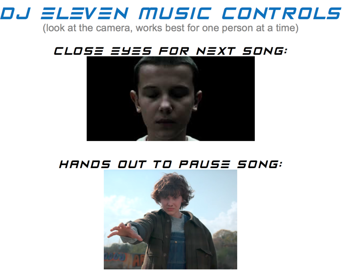

# DJ Eleven
This <b>*Stranger Things*</b>-inspired repo uses face, facial landmark, and hand detection from a live video stream (built-in camera or USB webcam) to control music stored locally. I wrote this program to let kids think they have special powers during Expedia's 2018 Halloween celebration.

### Controls (works best 1 person at a time)
**Blink** to advance to next song.  
**Hold out hand** to fade volume down till song is paused- song will resume when hand is no longer detected.
* Works best when camera sees **open hand (palm facing the camera)** and **fingers slightly spread out**.
* Can try to use both hands if having trouble detecting hands

### Files

`music/` 
Put your desired mp3 files in this folder

`models/` 
Contains models used for face/hand detection

`pygamemusicplayer.py` 
Class to control music (start, skip, volume control, pause, unpause)

`DJEleven.py` 
Run this script to start DJing!

### Packages
`scipy`, `imutils`, `dlib`, `opencv-contrib-python`, `pygame`

### Notes
* No changes needed in `DJEleven.py` when switching between built-in camera and USB webcam
* `hand-detectorC5.svm` and `hand-detectorC7.svm` are models I trained. I only spent a day on them, so they are inferior to `HandDetector.svm`, which I obtained from https://github.com/maatici/Hand-Landmarks-Detector

* I used this guide to install `dlib`:
    https://www.pyimagesearch.com/2017/03/27/how-to-install-dlib/

* Other guides I consulted:

  https://www.pyimagesearch.com/2017/04/24/eye-blink-detection-opencv-python-dlib/

  https://handmap.github.io/dlib-classifier-for-object-detection/
